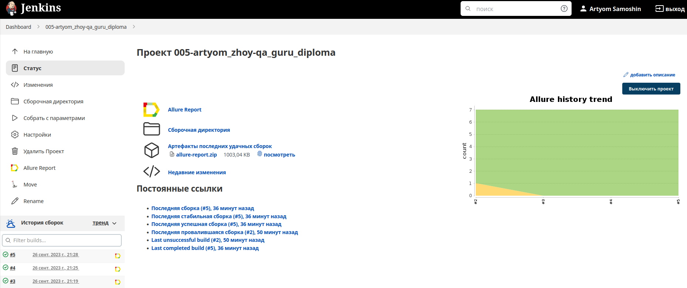
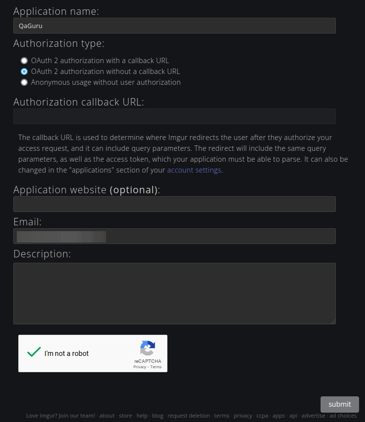
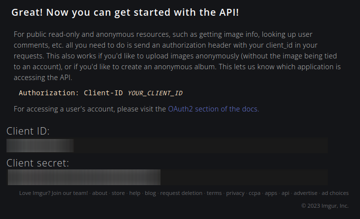
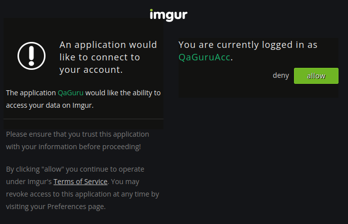
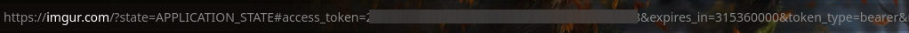
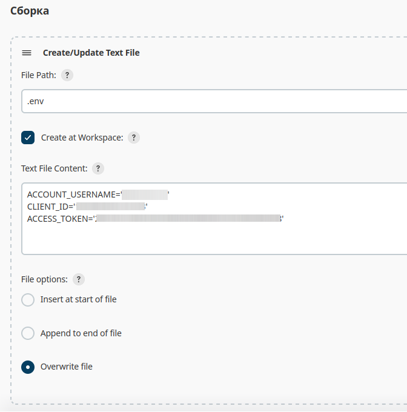
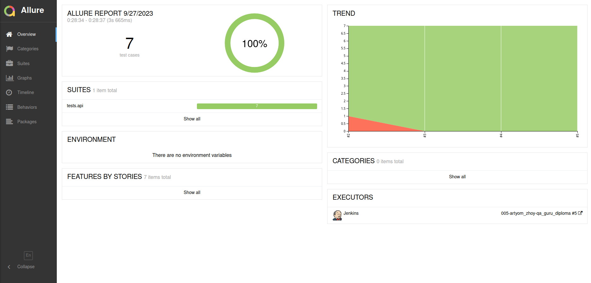
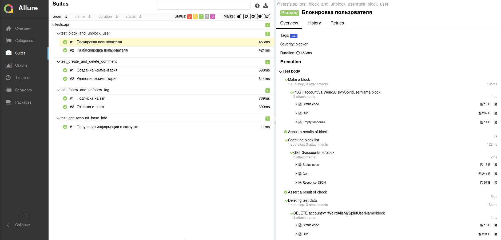
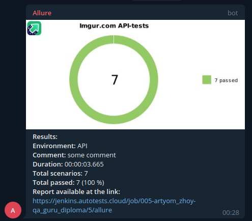

# QA Guru: Дипломный проект
Реализация набора автотестов (API) для сервиса <code>imgur.com</code>

## Инструменты и технологии, используемые в проекте
<p align="center">
  <code></code>
  <code></code>
  <code></code>
  <code></code>
  <code></code>
  <code></code>
  <code></code>
</p>

Весь проект выполнен на языке <code>Python</code>, а также дополнительно:
 - для API-тестов применялись: <code>Requests</code>, <code>JSONSchema</code>, <code>Curlify</code>.

Запуск тестов и формирование отчетов о запусках формируется с помощью:
 - <code>Jenkins</code>.

### <a href='https://github.com/artyomzhoy/qa_guru_diploma/tree/main/tests/api'>Сценарии API-тестов</a>
 - **Получение информации** по авторизованному аккаунту;
 - **Создание/удаление** комментария к публикации;
 - **Блокировка/разблокировка** пользователя;
 - **Подписка/отписка** от тэга.

### <a href='https://jenkins.autotests.cloud/job/005-artyom_zhoy-qa_guru_diploma/'>Jenkins job для API-тестов</a>


### Подготовка данных:

Для проведения тестирования сервиса <code>imgur.com</code> необходимо зарегистрироваться на нём, использовать имеющийся у вас аккаунт или воспользоваться конфигурацией файла <code>.env.public</code>. 

##### Регистрация/использование личного аккаунта:
1. После регистрации/авторизации нужно перейти по <a href='https://api.imgur.com/oauth2/addclient'>ссылке</a> и зарегистрировать приложение для тестов:

   - Указываем название приложения (любое);
   - Выбираем тип авторизации (OAuth 2 authorization without a callback URL);
   - Указываем Email;
   - Проходим CAPTCHA;
   - Подтверждаем создание приложения.



В результате получаем <code>Client ID</code> и <code>Client secret</code>. Для дальнейших шагов и тестирования понадобится только <code>Client ID</code> (сохраняем его).



2. Для получения токена авторизации **вставляем** в браузерную строку ссылку вида: <code> https://api.imgur.com/oauth2/authorize?client_id=CLIENT_ID&response_type=token&state=APPLICATION_STATE </code>
и заменяем <code>CLIENT_ID</code> на Client ID вашего аккаунта. 
Подтверждаем ввод в строку браузера и нажимаем **"allow"**. 



3. После подтверждения оказываемся на главной странице сервиса. В браузерной строке отображаются данные <code>access_token</code> и <code>account_username</code> (сохраняем их). 



4. Теперь можно подставить полученные данные **ACCOUNT_USERNAME**, **CLIENT_ID** и **ACCESS_TOKEN** в личный <code>.env</code> файл или настройки job в jenkins и успешно провести тестирование.

### Локальный запуск тестов:
Для локального запуска со значениями по умолчанию необходимо преименовать файл <code>.env.public</code> в <code>.env</code> и выполнить следующую команду в директории репозитория:
```
python -m venv .venv
source .venv/bin/activate
pip install poetry
poetry install --no-root
pytest .
```
Для локального запуска со значениями **вашей** учётной записи необходимо создать файл <code>.env</code> в корневой директории репозитория и подставить в него значения вашего аккаунта (**ACCOUNT_USERNAME**, **CLIENT_ID**, **ACCESS_TOKEN**) по аналогии с файлом <code>.env.public</code>.

Пример файла <code>.env</code> - <a href='https://github.com/artyomzhoy/qa_guru_diploma/blob/main/.env.public'>.env.public</a>

### Удалённый запуск тестов:
Для удалённого запуска API-тестов, в разделе **Сборка**, необходимо добавить шаг по созданию/изменению .env-файла с данными вашей учетной записи сервиса <code>imgur.com</code>(**ACCOUNT_USERNAME**, **CLIENT_ID**, **ACCESS_TOKEN**), либо с тестовыми данными, указанными в файле <code>.env.public</code>.

Пример файла <code>.env</code> - <a href='https://github.com/artyomzhoy/qa_guru_diploma/blob/main/.env.public'>.env.public</a>



## Отчёты

### Allure-reports

В каждом тесте указаны:

 - Pre-request/post-request steps, если они необходимы
 - Статус-код запроса
 - Curl запроса
 - Response сервера





### Telegram

Также, отчёт о результатах тестирования отправляется в <a href='https://t.me/zhoy_allure_reports'>Telegram бота</a>.


